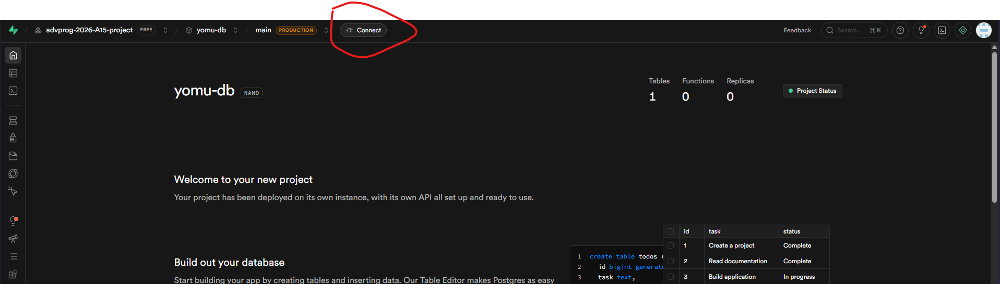
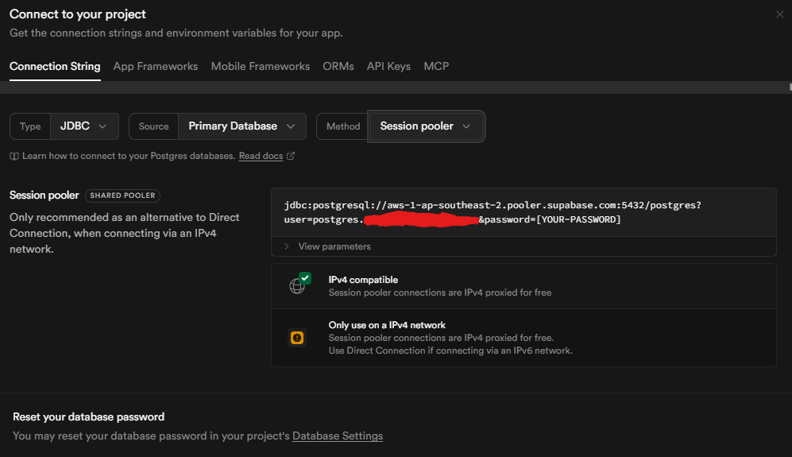

# Cara Setup Aplikasi

- Buka folder `backend` di IntelliJ IDEA Ultimate.
- Copy [`yomu\backend\src\main\resources\application.properties.example`](..\backend\src\main\resources\application.properties.example) ke `yomu\backend\src\main\resources\application.properties`, terus ikuti guide Setup DB Supabase.
- Jalankan/run BackendApplication (tombol segitiga hijau).
- Buka folder `frontend` di terminal.
- Pastikan terinstall NodeJS v24.13.1.
- Jalankan `npm install` lalu `npm run dev`
- Buka alamat localhost yg keluar di browser

# Cara Setup DB Supabase
- Login ke [Supabase](https://supabase.com)
- Buat project baru (simpan passwordnya)
- Klik Connect

- Type: JDBC, method: session pooler

- Copy URL nya, taruh di `application.properties` bagian
`spring.datasource.url`, modif belakangnya pakai `/postgres?sslmode=require`
Contoh:
`spring.datasource.url=jdbc:postgresql://aws-1-ap-southeast-2.pooler.supabase.com:5432/postgres?sslmode=require`
- User ditaruh di `spring.datasource.username`
Contoh:
`spring.datasource.username=postgres.xxxxxxxxxxxxxxxxxxxx`
- `spring.datasource.password=[PASSWORD PROJECT KALIAN]`
